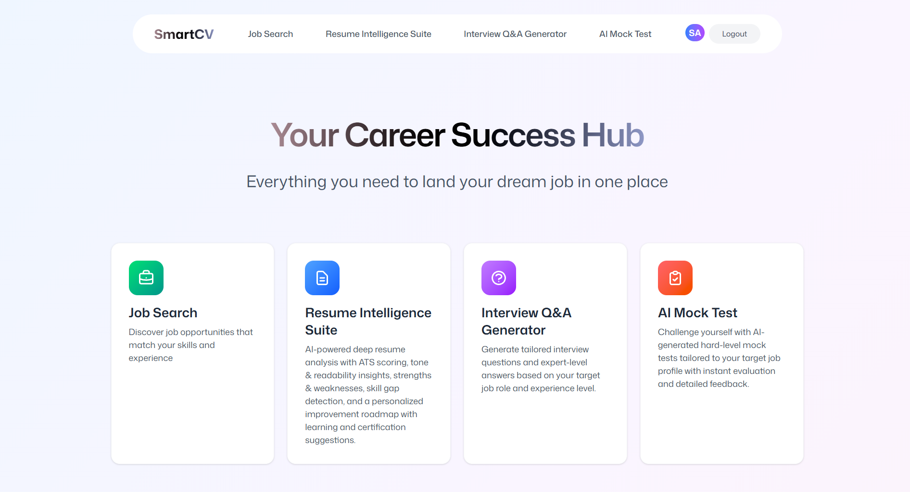

# 🚀 SMART-CV: AI-Powered Career Companion

SMART-CV is a full-stack AI career assistance platform that helps users optimize resumes, prepare for interviews, assess job readiness, and discover relevant job opportunities from a single dashboard.

## ✨ Features

- 📄 AI-powered resume analysis with ATS scoring and skill-gap detection
- 🛣 Personalized career roadmaps based on resume insights and target roles
- 🎯 Role-specific interview question generation with AI-powered answers
- 🧠 Adaptive mock tests with automated evaluation and feedback
- 💼 Real-time job discovery using JSearch API
- 🔐 Secure authentication and persistent user data management

## 🛠 Tech Stack

**Frontend**
- React.js
- TypeScript
- Tailwind CSS
- Zustand
- React Router

**Backend**
- Node.js

**Database & Auth**
- Supabase

**APIs**
- Groq API
- JSearch API

## 📋 Core Modules

- Resume Intelligence Suite
- Career Roadmap Generator
- AI Interview Preparation
- AI Mock Test Engine
- Job Search Portal
- Authentication & User Management

## 📸 Screenshots

### Dashboard


### Resume Analysis Result


### Career Roadmap


### AI Interview Preparation


### Mock Test Evaluation


### Job Search Result


## 📊 Results

- ⭐ 92.75% overall user satisfaction
- 📈 95% users found resume feedback helpful
- 🎯 90% users found interview questions relevant
- 🚀 88% preferred SMART-CV over multiple career platforms

## 🚀 Getting Started

```bash
git clone https://github.com/Asmi100804/Smart-CV-AI-Career-Assistant.git
cd Smart-CV-AI-Career-Assistant

npm install
npm run dev
```

